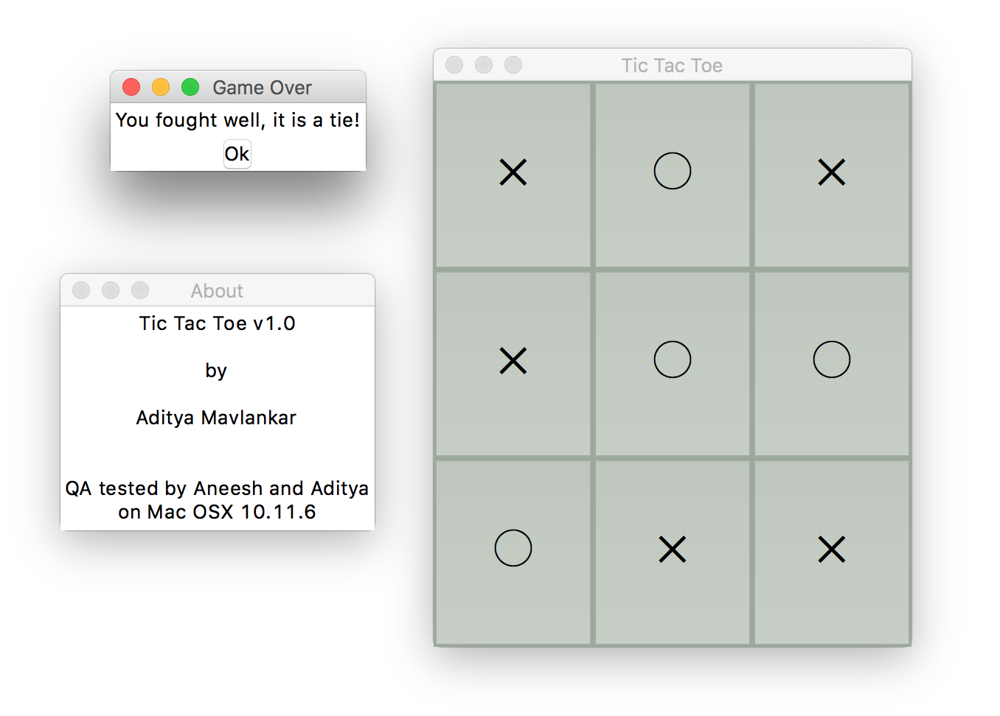

# tic_tac_toe
Interactive 2 player tic tac toe game

* Tested on Python 3.6 but I expect it to run on Python 3.0 and above.

Our son, Aneesh, was introduced to playing tic-tac-toe in school. Naturally, he wanted to play a game or two at home, so I asked him to make few "grids" on paper. The grids drawn by a four year old turned out to not have the best alignment, size, etc. 

At this point, the words of my Python instructor (five bucks** for guessing his name which starts with R) came to mind: **_"There has to be a better way!"_**

##### **metaphorical five bucks :)

I took a crack at writing some Python code and I must say I am quite happy with what [100 (ish) lines of Python code](./tic_tac_toe_concise.py) could do for Aneesh and me. Some screenshots of the game:

Some Python constructs used in [code](./tic_tac_toe_concise.py):
  * List comprehension
  * _namedtuple_
  * _lambda_
  * _any(condition generator-expression)_
  * f Strings
  * int(bool) for calculating index

  